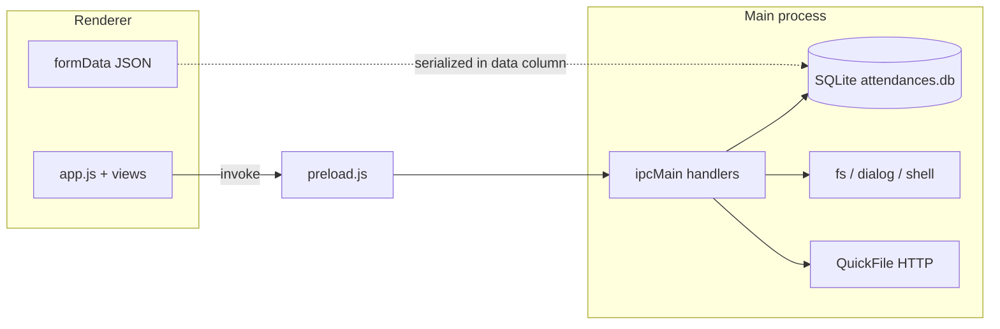

# Custody Note — Full Application Deep Audit Report

**Scope:** Entire Electron desktop app (`custody-note-app`): architecture, workflows, data, security surface, billing/documents/attachments, sync, backup, licence, auth.  
**Method:** Static code review, IPC/schema tracing, execution of `npm run test:unit`. No production DB or live QuickFile calls.  
**Date:** 2026-03-28  

---

## 1. Executive Summary

Custody Note is an **offline-first Electron application** using **encrypted SQLite (sql.js)** for persistence. The **renderer** (`index.html`, `app.js`, `renderer/**`) holds rich **in-memory `formData`**; the **main process** (`main.js`) owns the database and exposes capabilities through **`preload.js`** (`contextBridge`). There is **no multi-tenant server** inside the app: **“permissions” are device-local** (licence, optional session lock, supervisor credential for specific actions).

This audit mapped **all major IPC handlers**, **schema**, and **user journeys**. **Unit tests** were run successfully (including new regression tests). One **data-integrity defect** was found and **fixed**: **draft deduplication and import-merge** could previously match **archived** draft rows, causing new work to merge into **hidden** records. Queries now require **`archived_at IS NULL`** alongside **`deleted_at IS NULL`**.

Remaining risks cluster around: **large JSON blobs** (attachments as base64 inside `data`), **denormalised invoice columns** vs `formData`, **no automated E2E** for full UI flows, **`open-path` IPC** accepting arbitrary filesystem paths, and **`attendance-force-status`** as a powerful escape hatch.

---

## 2. Relevant Files Found

| Area | Primary files |
|------|----------------|
| Main / DB / IPC | `main.js` |
| Preload API | `preload.js`, `password-preload.js` |
| UI shell & state | `index.html`, `app.js`, `styles.css` |
| Forms / sections | `renderer/form-renderer.js`, large section logic in `app.js` |
| List / search | `renderer/views/list.js` |
| Billing | `renderer/billingUtils.js`, `renderer/views/billing.js`, `billing-screen.js`, `billing-view.js`, `billable-attendances.js` |
| Workflow stepper | `renderer/views/workflow-stepper.js` |
| Documents / attachments UI | `renderer/views/documents-screen.js` |
| PDF / export | `renderer/pdf-builder.js`, `main.js` (`print-to-pdf`, `export-docx`, `laa-generate-official-pdf`) |
| Audit UI | `renderer/audit-log.js` |
| Settings / firms / stations | `renderer/views/settings.js`, `authorities.js`, `station-mileage-admin.js` |
| Sync | `main/syncWorker.js`, sync IPC in `main.js` |
| Backup | `main/backupScheduler.js`, IPC handlers in `main.js` |
| Licence | `main/licenceStore.js`, `main/licenceIpc.js`, `renderer/licence.js` |
| Auth (magic link etc.) | `main.js` (`auth:*` handlers) |
| Tests | `tests/*.test.js`, `scripts/smoke-test.js` |

---

## 3. Full System Map

### 3.1 Architecture

- **BrowserWindow** uses `nodeIntegration: false`, `contextIsolation: true` (see `main.js` ~440, 1986).
- **Persistence:** `attendances` row = metadata columns + **`data` TEXT** (full form JSON).
- **Derived columns:** `client_name`, `station_name`, `dscc_ref`, `attendance_date`, `work_type`, billing/invoice columns, `sync_*`.

### 3.2 Database (core)

- **`attendances`:** id, timestamps, `data`, `status`, soft-delete, archive, supervisor fields, **QuickFile invoice columns**, **sync_id / sync_dirty / sync_version**.
- **`audit_log`:** per-record actions; richer diff on finalisation path in `attendance-save`.
- **`billing_audit_log`:** billing-specific events.
- **`firms`**, **`police_stations`**, **`settings`**.
- **`sync_queue`**, **`sync_attempts`**, **`sync_conflicts`:** cross-device sync and conflict recording.

### 3.3 IPC surface (representative)

- **CRUD:** `attendance-list`, `attendance-list-full`, `attendance-search`, `attendance-get`, `attendance-save`, `attendance-delete`, `attendance-archive`, `attendance-unarchive`, `attendance-undelete`, `attendance-force-status`.
- **Files:** `pick-file`, `pick-image`, `print-to-pdf`, `export-docx`, `photo-save/load/delete`.
- **Billing:** `quickfile-create-invoice`, `billing-view-records`, `billable-attendances`, `attendance-invoice-status`, `billing-audit-log-*`.
- **Operational:** backup, sync, licence, auth, settings, CSV export, supervisor approval.

### 3.4 Stale / inconsistent state (high level)

| Location | Risk |
|----------|------|
| `formData` vs last `attendance-save` | Unsaved edits; crash before save |
| Invoice columns in DB vs `formData` | Partial QuickFile success; reopen record |
| Attachments in `data` blob | Memory size; no separate file store |
| Sync | Conflict rows; `sync_dirty` flags |
| UI list cache (`_recordCache` in `app.js`) | Stale row display until refresh |

### 3.5 Roles

- **Single professional user** on device; **supervisor** actions gated by **`verifySensitiveActionCredential`** (e.g. `supervisor-approve`).
- **No** app-internal role matrix beyond licence/trial and optional cloud features.

---

## 4. True Workflow Reconstructed

### 4.1 Authentication / licence

- **Licence:** activate/deactivate/validate via IPC; banner in renderer (`licence.js`).
- **Auth magic-link handlers** exist in `main.js` for flows that need online identity (paired with website/backend elsewhere).

### 4.2 Dashboard / navigation

- Views: **home, list, form (new/edit), firms, settings, reports, authorities, help, station-mileage, billing, quickcapture**.
- **Bottom nav** + **home cards** drive `showView()` in `app.js`.

### 4.3 Create / edit attendance

1. User fills sections; **autosave** / explicit save calls **`attendanceSave`** with `{ id?, data, status }`.
2. **New draft:** may **merge** into existing draft via **`findExistingDraftIdByCaseKey`** (DSCC or client+date+dedupe key) or recent-duplicate guard.
3. **Finalise:** `status: 'finalised'` — **`attendance-save`** blocks further non-finalise writes when row is finalised; writes audit diff fields; **flushDb** on finalise.
4. **Unlock:** special path `unlock: true` to return to draft (audited).

### 4.4 Attachments

- Primary store: **`formData.photos.attachments[]`** with **base64 `dataUrl`** in JSON.
- Workflow **Documents** step: pick file via IPC, size limits in main, cap count in UI (e.g. max attachments in `documents-screen.js`).
- **Legacy** photo APIs (`photo-save`, etc.) for older paths — coexist with blob-in-JSON model.

### 4.5 Documents / PDF

- **HTML → PDF** via hidden `BrowserWindow` + `printToPDF` (`main.js`).
- **LAA** official PDF generation IPC.
- **DOCX export** IPC.

### 4.6 Billing / QuickFile

- **Workflow stepper** or **Billing view** opens billing UI.
- **Totals** from `billingUtils.js` (`calculateInvoiceTotals`, rounding rules).
- **`quickfile-create-invoice`:** server-side **duplicate guard** unless `allowDuplicate` after user confirms in renderer.
- Invoice metadata persisted to **`attendances`** columns and billing audit log.

### 4.7 Delete / archive

- **Soft delete:** `deleted_at`, reason; **undelete** supported.
- **Archive:** `archived_at` set; hidden from default lists.

### 4.8 Search / export

- **`attendance-search`:** parameterized LIKE + filters for archived/deleted.
- **CSV export:** date range, `csvSafe` injection mitigation for spreadsheet formulas.

---

## 5. Deep Test Coverage Performed

| Layer | Executed |
|-------|----------|
| Unit | `npm run test:unit` — all tests green |
| New static regression | `tests/fullAppAudit.test.js` — draft/archived integrity, open-external, invoice guard, finalise lock |
| E2E / Playwright | Not re-run in this session; `playwright-report` exists in repo from prior runs |

**Manual / not executed here:** full UI click-through, live QuickFile, multi-machine sync conflict resolution.

---

## 6. Highest-Risk Areas

1. **Legal record accuracy** — single JSON blob; finalise lock; supervisor approval path.
2. **Billing** — QuickFile API failures, duplicate invoices, rounding (mitigated in earlier audit + tests).
3. **Attachments** — memory, no filesystem dedupe, embedded base64.
4. **Sync** — conflict handling complexity; version fields.
5. **IPC power** — `open-path`, `attendance-force-status`, `attendance-delete`.

---

## 7. Confirmed Defects

| ID | Title | Severity | Status |
|----|--------|-----------|--------|
| C1 | Draft dedupe / import merge could target **archived** drafts | DATA INTEGRITY RISK → HIGH | **Fixed** (`archived_at IS NULL` in relevant queries) |

---

## 8. Likely Defects / Risks

- **`findExistingDraftIdByCaseKey`** client+date branch uses **LIMIT 5** without `station_name` in SQL; relies on in-memory key match — **theoretically** could miss correct draft under heavy same-day volume (LOW/MEDIUM, performance/consistency edge).
- **`attendance-get`** returns subset of columns — UI must not assume invoice fields without separate load (stale UI if inconsistent).
- **Multi-tab:** not applicable unless multiple windows; single user assumed.
- **`showModal(html)`** in `toast.js` — XSS if untrusted HTML passed (caller discipline required).

---

## 9. Workflow Weaknesses

- **Attachment model** — large records, slow search/backup; no per-file integrity hash surfaced to user.
- **Regenerate PDF / invoice after edit** — user must understand **source vs output**; limited “stale output” warnings.
- **Force status** — powerful; should be rare and audited (audit_log entry exists).

---

## 10. Security / Privacy Findings

- **Good:** `contextIsolation`, no `nodeIntegration` in renderer; `open-external` restricted to http(s); mailto discouraged.
- **Risk:** **`open-path`** — any path string; mitigated by trusted app code paths only (if renderer compromised, impact high).
- **Risk:** **No IPC authentication** between renderer and main — standard for desktop single-user apps.
- **Sensitive data** — DB encryption / recovery password flows present; review `session-unlock` and backup encryption separately for deployment hardening.

---

## 11. Data Integrity Findings

- **Finalised lock** enforced in `attendance-save` (confirmed in tests).
- **Soft delete** consistent in list queries (`deleted_at IS NULL`).
- **Archive** now consistent with **draft dedupe** after fix.
- **Invoice duplicate** guard in `quickfile-create-invoice` (confirmed in tests).

---

## 12. Performance / Scalability Risks

- **Large `data` blobs** — JSON parse/stringify on each save; attachments inflate size.
- **Search** — multiple `json_extract` LIKE patterns; acceptable for local DB until very large corpora.
- **PDF generation** — extra BrowserWindow per operation; timeouts in place.

---

## 13. Proposed Workflow Improvements

| Improvement | Scope |
|-------------|--------|
| Store attachments as **files on disk** + references in JSON | Larger refactor |
| **Explicit “billing snapshot”** version when invoice created | Medium |
| **Stale banner** when form changed after PDF/invoice | Quick–medium |
| **E2E suite** for finalise → workflow → invoice (mock QuickFile) | Medium |
| Narrow **`open-path`** to exports directory or user-chosen roots | Medium |

---

## 14. Autofixes Applied

| Change | Why safe | Files |
|--------|-----------|--------|
| Exclude **`archived_at IS NULL`** from draft dedupe, import file-number merge, and **`dedupeDraftsByCaseKey`** | Aligns with list views that hide archived records; prevents silent merge into hidden rows | `main.js` |

**Migration:** None (query predicate only).

---

## 15. Autofixes Proposed But Not Applied

- **SQL LIMIT + station** refinement for draft lookup (needs profiling + tests).
- **`open-path`** sandbox to allowed directories.
- **Remove or gate `attendance-force-status`** behind stronger policy UI.

---

## 16. Tests Added / Updated

- **`tests/fullAppAudit.test.js`** — static assertions on `main.js` for archived draft filtering, `open-external`, invoice duplicate guard, finalise lock.

---

## 17. Top 20 Problems Ranked

1. Embedded base64 attachments in JSON (size, memory, backup time)  
2. No built-in “document stale” warning after source edits  
3. `open-path` IPC breadth  
4. `attendance-force-status` operational risk  
5. Limited automated E2E coverage for full journeys  
6. Draft dedupe LIMIT 5 edge case (client+date)  
7. QuickFile partial failure states (invoice vs attachment) — historically painful  
8. Sync conflict UX complexity  
9. `showModal` HTML trust model  
10. Multi-step billing workflow discoverability  
11. Record cache staleness in UI  
12. Performance on very large `data` fields  
13. Audit log verbosity vs storage growth  
14. CSV export field coverage vs LAA needs (business rule)  
15. Trial/licence edge cases across offline periods  
16. Session lock bypass if attacker has filesystem access  
17. Photo legacy vs attachments dual model confusion  
18. Duplicate prevention relies on case key quality (empty DSCC)  
19. Search LIKE performance at scale  
20. Dependency on external services (QuickFile, GOV holidays API) for some features  

---

## 18. Top 20 Quick Wins Ranked

1. **Done:** archived draft dedupe fix + tests  
2. User-visible note: “Invoice created — PDF may not reflect later edits”  
3. Add **Vercel/GitHub**-style release notes link in Help  
4. Toast when **quietSave** fails (if not already universal)  
5. Disable **Create invoice** until firm selected (if not already)  
6. Log **billing_audit_log** on more failure branches  
7. **Copy DSCC** button in list meta (UX)  
8. Explicit **max attachment size** in UI copy  
9. Search debounce tuning in list view  
10. Keyboard shortcut legend in Help  
11. Export **billing audit** to CSV from settings (small feature)  
12. Preflight checklist component reuse across workflow steps  
13. Highlight **unsaved changes** when switching views  
14. Retry button on QuickFile network errors  
15. Structured error codes for invoice failures  
16. Unit test for **`attendance-export-csv`** csvSafe  
17. Document **`allowDuplicate`** in internal dev doc only  
18. Index suggestions if DB grows (SQLite analyze)  
19. Batch **flushDb** policy documentation  
20. Playwright smoke: open app, new draft, save  

---

## 19. Highest Priority Next Actions

1. Run **Playwright / manual** smoke on **finalise → billing → invoice** after each release.  
2. **Monitor** installer + `latest.yml` on GitHub (already part of release hygiene).  
3. Plan **attachment externalisation** if users hit size/slowness limits.  
4. **Review** `attendance-force-status` usage and restrict to support builds if possible.  

---

## 20. Management Summary

Custody Note is a **mature single-user legal workflow tool** with **strong finalisation locking**, **audit logging**, and **structured billing integration**. The main residual product risks are **scale of stored documents inside the database**, **dependence on correct user process** after invoices/PDFs are produced, and **operational discipline** around exceptional admin IPCs. One **concrete integrity bug** in draft merging with **archived** records was **found and fixed**, with **automated regression checks** added.

---

## 21. Developer Summary

- **Trust boundary:** renderer ↔ main via **preload** only; keep **`contextIsolation`**.  
- **Single source of truth for form:** `data` column JSON; keep **indexed columns** in sync in **`attendance-save`**.  
- **Billing:** `renderer/billingUtils.js` + **`quickfile-create-invoice`**; **`allowDuplicate`** flows from confirm in `billing.js`.  
- **Tests:** run **`npm run test:unit`**; extend **`tests/fullAppAudit.test.js`** for new IPC invariants.  
- **Draft dedupe:** always filter **`deleted_at IS NULL` AND `archived_at IS NULL`** for any “find existing draft” logic.

---

*End of report.*
